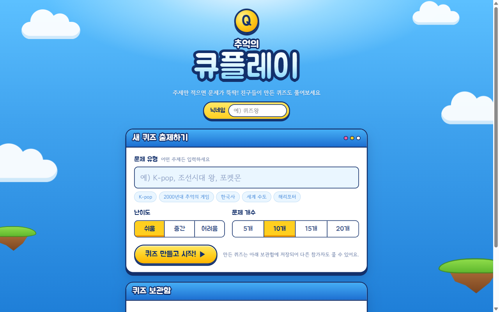
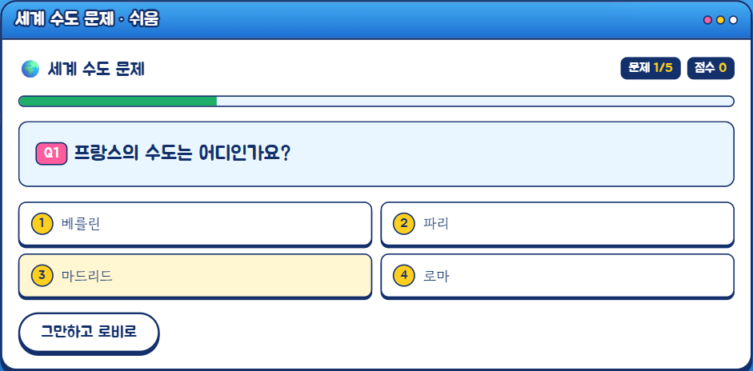
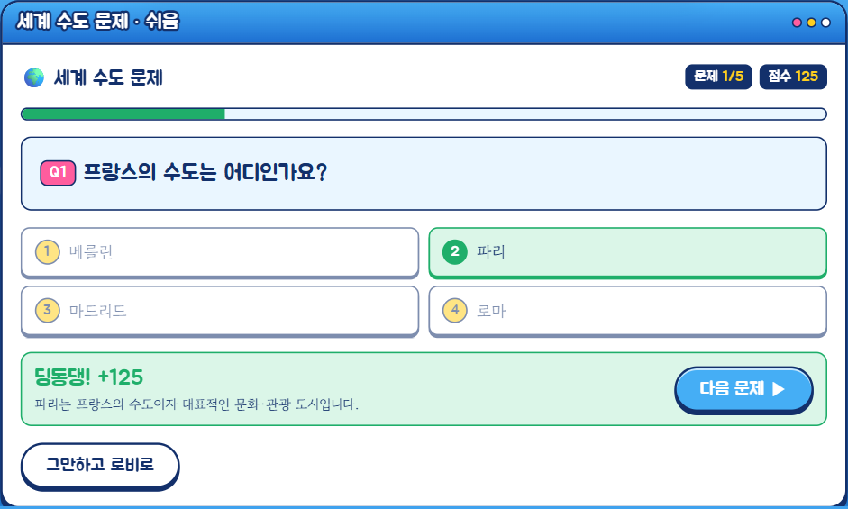
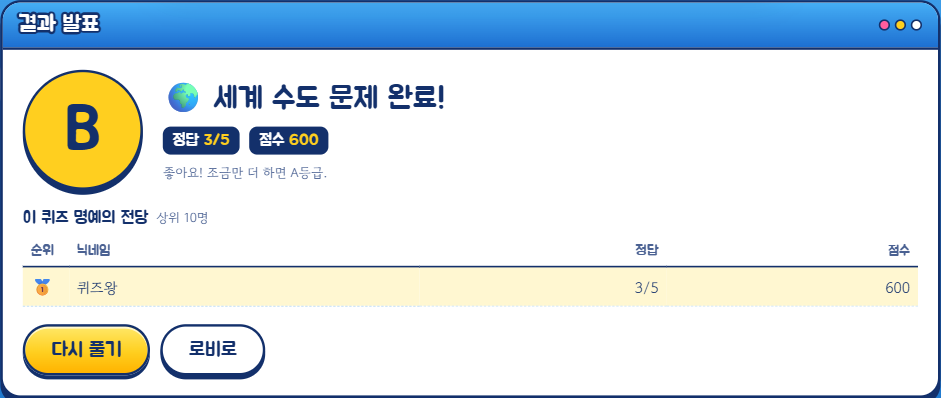

# 추억의 큐플레이 🎮

닉네임만으로 참여하는 AI 퀴즈 게임입니다. 주제·난이도·문제 수를 고르면 OpenAI가 4지선다 퀴즈를 만들어 주고, 다른 사람이 만든 퀴즈를 풀어 점수 순위(TOP 10)를 겨룰 수 있어요.

## 게임 화면

| 로비 · 퀴즈 출제 | 문제 풀기 |
|---|---|
|  |  |
| **정답 확인 · 해설** | **결과 · 명예의 전당** |
|  |  |

## 주요 기능

- **AI 퀴즈 생성**: 주제(최대 30자), 난이도(쉬움/보통/어려움), 문제 수(5·10·15·20)를 고르면 자동 출제
- **퀴즈 목록**: 모두가 만든 퀴즈를 최신순으로 보고, 몇 번 플레이됐는지 확인
- **랭킹**: 퀴즈마다 점수 기준 상위 10명 표시
- **로그인 없음**: 닉네임(최대 12자)만 입력하면 참여

## 폴더 구조

```
public/index.html   게임 화면 (프론트엔드)
api/                Vercel 서버리스 함수 (generate, quizzes, plays)
lib/handlers.js     API 처리 로직 (Vercel과 로컬 서버가 함께 사용)
lib/quiz.js         OpenAI로 퀴즈 생성
lib/store.js        저장소: Upstash Redis 또는 로컬 data/quizzes.json
server.js           로컬 실행용 서버
```

## API

| 경로 | 메서드 | 설명 |
|---|---|---|
| `/api/quizzes` | GET | 퀴즈 목록 |
| `/api/generate` | POST | 퀴즈 생성 (`topic`, `difficulty`, `count`, `creator`) |
| `/api/plays?id=퀴즈ID` | GET | 해당 퀴즈 TOP 10 |
| `/api/plays?id=퀴즈ID` | POST | 플레이 결과 기록 (`nick`, `correct`, `score`) |

## 환경변수

API 키는 저장소에 올리지 않습니다. 직접 `.env` 파일을 만들어 넣어 주세요.

```
OPENAI_API_KEY=발급받은_키
OPENAI_MODEL=gpt-5.6-luna            # 선택, 기본값
UPSTASH_REDIS_REST_URL=...           # 선택, 없으면 로컬 파일에 저장
UPSTASH_REDIS_REST_TOKEN=...
```

## 로컬에서 실행

Node.js 24가 필요합니다.

```bash
npm install
npm start
```

브라우저에서 http://localhost:3000 을 열면 됩니다. 같은 와이파이의 다른 기기에서도 터미널에 표시되는 주소로 접속할 수 있어요.

## 배포 (Vercel)

`public/`은 정적 페이지로, `api/*.js`는 서버리스 함수로 배포됩니다. Vercel 프로젝트 설정에서 위 환경변수를 등록하고, 저장소로 Upstash Redis를 연결하세요.

## 소개 영상 (Remotion)

`video/` 폴더에 30초짜리 소개 영상(1920×1080) 소스가 있습니다. 게임 화면을 React로 다시 그려 애니메이션으로 만들었어요.

```bash
cd video
npm install
npm run studio   # 브라우저에서 미리보기·수정
npm run render   # out/qplay-intro.mp4 로 렌더링
```
